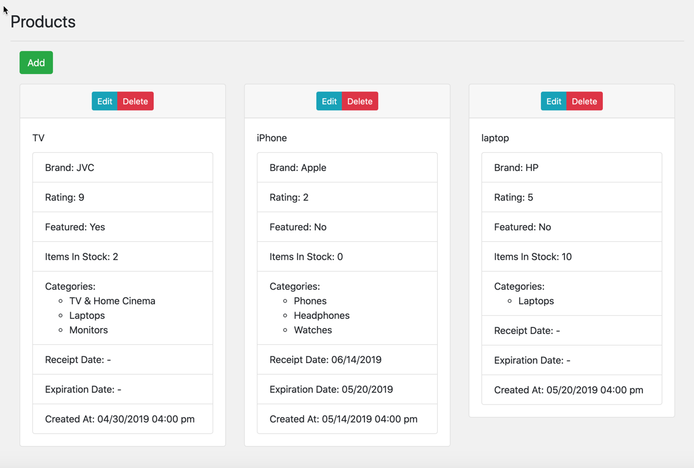
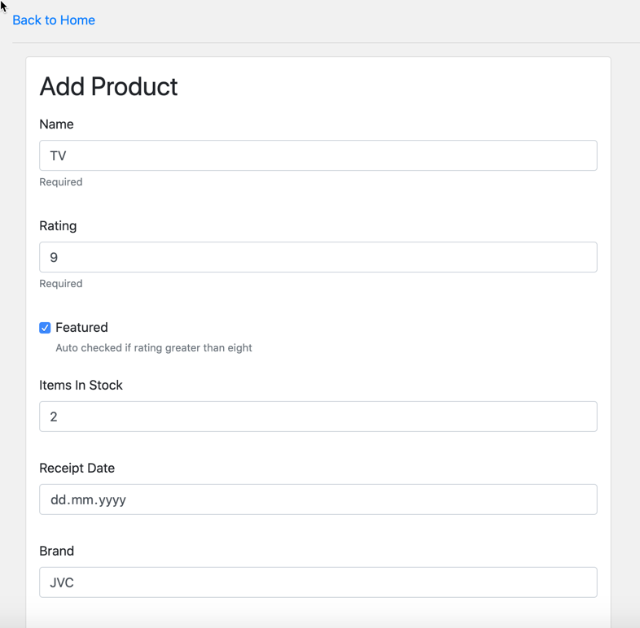

# Products CRUD App

### 1 Purpose
Add Create/Update/Delete features to CRA app.

### 2 Libraries
* Create react app
* Formik
* Yup
* moment.js
* reactstrap

### 3 Features
* Without React hooks, in same style as original app
* Advanced Linting
* Deploy to github pages
* Dockerfiles for local use without any dependencies

### 4 Screenshot

### 5 Demo
https://menemy.github.io/cra-products-crud/
